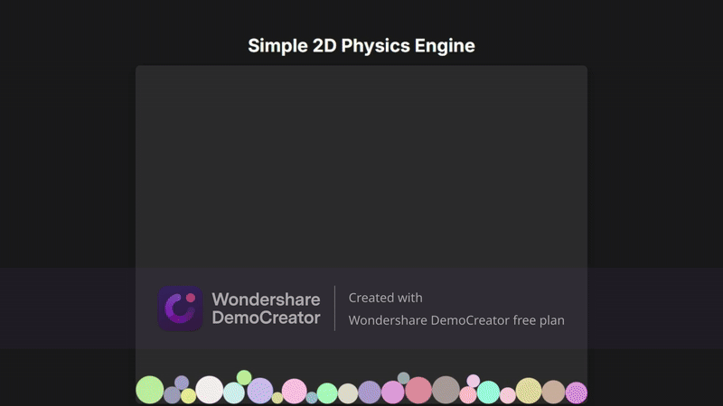

# Real-Time Multiplayer Physics Sandbox

A 2D physics engine built from scratch with a real-time multiplayer layer. This project features an authoritative server-client architecture where the server runs the complete physics simulation and broadcasts the state to multiple clients, allowing users to interact in a shared, synchronized environment.



## Core Features

-   **Authoritative Server:** A Node.js server runs the entire physics simulation, ensuring a consistent state for all clients and preventing cheating.
-   **Real-Time Communication:** Uses WebSockets for low-latency, bidirectional communication between the server and clients.
-   **Shared Interaction:** Multiple users can simultaneously click, drag, and interact with objects in the shared physics world.
-   **Custom Physics Engine:** All physics, including gravity, restitution, and collision resolution, were implemented from first principles.

## Technologies Used

-   **Back-End:** Node.js, WebSocket (`ws` library)
-   **Front-End:** Vanilla JavaScript, HTML5 Canvas
-   **Core Concepts:** Client-Server Architecture, Real-Time State Synchronization, Data Serialization (JSON)

---

## How to Run the Full Multiplayer Version Locally

To experience the multiplayer functionality, you must run the server on your machine.

**Prerequisites:**
-   [Node.js](https://nodejs.org/)
-   [Git](https://git-scm.com/)

**1. Clone the Repository**
```bash
git clone [https://github.com/DerekNest/2d-physics-engine.git](https://github.com/DerekNest/2d-physics-engine.git)
cd 2d-physics-engine
